## UFO Data Analysis Using Python

```python
import numpy as np
import pandas as pd
import matplotlib.pyplot as plt
import seaborn as sns
from scipy import stats
import statsmodels.api as sm
```

#### Data Description and Summary

It is crucial to record and examine UFO sightings for a number of reasons. First of all, technology makes it possible for researchers to compile and assess information from a variety of sources, such as eyewitness statements, video recordings, and images. These pieces of information can help scientists better comprehend UFOs and their strange behavior by revealing important details about their nature.

Second, tracking down and examining UFO sightings might reveal patterns and trends in their behavior and appearance. By examining these patterns, scientists may be able to pinpoint the credibility of claims of extraterrestrial visitations, such as natural occurrences or man-made artifacts.

Finally, researching and documenting UFO encounters might help eliminate rumors and false information about these events. Researchers can provide evidence-based answers that can aid in lowering fear, worry, and bewilderment around these events by rigorously evaluating accounts of UFO encounters.

This data comes originally from NUFORC otherwise known as the National UFO Reporting Center, a non-profit Washington State corporation. The center’s function over the past four decades it has been operating has been to gather, record, and corroborate reports from individuals who have reportedly witnessed UFO-related activity. The data includes over 80,000 UFO sightings that have been observed around the world, which encompasses fields with information on the UFO shape, latitude, longitude, state and country where the sighting occurred, the duration of the sighting event, and the time (in military time) that the sighting happened. Although the original dataset is found from the NUFORC database, this version of the dataset was further cleaned up and found on GitHub by Sigmond Axel. 

Several factors can have an impact on the process of gathering and documenting data on UFO sightings, which could affect the dataset's accuracy and completeness. The dependability of the eyewitnesses who report the sightings is one of the key variables that can affect what information is observed and recorded. Depending on variables including their proximity to the sighting, their level of competence in seeing aerial phenomena, and their emotional condition at the time of the incident, certain eyewitnesses may be more trustworthy than others and their stories may be more precise or comprehensive.

The techniques employed to document and record the sightings can also have an impact on the data gathered. For instance, there may be a larger chance of missing sightings that were not reported or were incorrectly recorded if the data gathering process just uses self-reported sightings. Similar to the last point, if the data gathering procedure depends on a certain sort of technology, like radar or video cameras, it might not record all UFO sightings, like those that happen at lower altitudes or are only visible to the human eye.

The data that is observed and recorded might also be influenced by social and cultural factors. For instance, if a person believes in extraterrestrial life or has a particular interest in the issue, they may be more inclined to report UFO encounters. Others, on the other hand, might be less inclined to report sightings out of concern for the stigma or mockery attached to doing so.

Overall, these elements must be taken into account when examining a dataset that contains data on UFO sightings. Researchers can more accurately assess the trustworthiness and validity of the data and reach more accurate conclusions regarding these puzzling phenomena by recognizing the potential biases and constraints of the data collection method.

In this project, we aim to analyze factors that impact the number of sightings. Specifically, we want to see whether location, as determined by longitude and latitude, affect how many reports there are and whether they are more prevalent in rural or urban areas. We also want to find trends or patterns over time, identifying the number of sightings per month and year by certain UFO attributes such as shape. The impact of light is also a factor that should be influential, which is why we are also interested in analyzing whether most sightings occur in the daytime or nighttime. 

For practical purposes, it can be crucial to analyze the variables that affect the frequency of UFO reports. For companies or government agencies engaged in monitoring and researching these phenomena, it might, for instance, assist in identifying regions with greater frequencies of sightings. The findings of this investigation may also serve to improve data gathering and reporting practices, which may help to improve the precision and comprehensiveness of databases on UFO sightings.

Researchers could learn whether there are seasonal or cyclical elements that affect the frequency of sightings by looking at trends and patterns throughout time. They may, for instance, determine whether specific UFO shapes are more common throughout specific months or years, which could illuminate possible reasons for these sightings.

It may be useful for organizations involved in tracking and responding to these occurrences to examine whether UFO sightings are more common in urban than rural locations. For instance, if sightings are more common in cities, this may indicate that more individuals are watching these events, which could have effects on public safety and security.


```python
df = pd.read_csv("ufo_sightings.csv")
```


```python
df.head()
```


<div>
<style scoped>
    .dataframe tbody tr th:only-of-type {
        vertical-align: middle;
    }

    .dataframe tbody tr th {
        vertical-align: top;
    }

    .dataframe thead th {
        text-align: right;
    }
</style>
<table border="1" class="dataframe">
  <thead>
    <tr style="text-align: right;">
      <th></th>
      <th>Location.City</th>
      <th>Location.State</th>
      <th>Location.Country</th>
      <th>Data.Shape</th>
      <th>Data.Encounter duration</th>
      <th>Data.Description excerpt</th>
      <th>Location.Coordinates.Latitude</th>
      <th>Location.Coordinates.Longitude</th>
      <th>Dates.Sighted.Year</th>
      <th>Dates.Sighted.Month</th>
      <th>Date.Sighted.Day</th>
      <th>Dates.Sighted.Hour</th>
      <th>Dates.Sighted.Minute</th>
      <th>Dates.Documented.Year</th>
      <th>Dates.Documented.Month</th>
      <th>Dates.Documented.Day</th>
    </tr>
  </thead>
  <tbody>
    <tr>
      <th>0</th>
      <td>anchor point</td>
      <td>AK</td>
      <td>US</td>
      <td>disk</td>
      <td>300.0</td>
      <td>Large UFO over Mt. ILIAMNA Alaska.  ((NUFORC N...</td>
      <td>59.776667</td>
      <td>-151.831389</td>
      <td>2005</td>
      <td>5</td>
      <td>24</td>
      <td>18</td>
      <td>30</td>
      <td>2005</td>
      <td>5</td>
      <td>28</td>
    </tr>
    <tr>
      <th>1</th>
      <td>anchorage</td>
      <td>AK</td>
      <td>US</td>
      <td>changing</td>
      <td>21600.0</td>
      <td>We could observe red lights dancing across the...</td>
      <td>61.218056</td>
      <td>-149.900278</td>
      <td>2000</td>
      <td>12</td>
      <td>31</td>
      <td>21</td>
      <td>0</td>
      <td>2001</td>
      <td>2</td>
      <td>18</td>
    </tr>
    <tr>
      <th>2</th>
      <td>anchorage</td>
      <td>AK</td>
      <td>US</td>
      <td>changing</td>
      <td>600.0</td>
      <td>INTENSE AMBER-ORANGE HONEYCOMB SHAPED DUAL HOR...</td>
      <td>61.218056</td>
      <td>-149.900278</td>
      <td>2006</td>
      <td>10</td>
      <td>23</td>
      <td>21</td>
      <td>3</td>
      <td>2006</td>
      <td>12</td>
      <td>7</td>
    </tr>
    <tr>
      <th>3</th>
      <td>anchorage</td>
      <td>AK</td>
      <td>US</td>
      <td>cigar</td>
      <td>15.0</td>
      <td>I explained away the first time I thought I se...</td>
      <td>61.218056</td>
      <td>-149.900278</td>
      <td>2014</td>
      <td>3</td>
      <td>29</td>
      <td>20</td>
      <td>45</td>
      <td>2014</td>
      <td>4</td>
      <td>4</td>
    </tr>
    <tr>
      <th>4</th>
      <td>anchorage</td>
      <td>AK</td>
      <td>US</td>
      <td>circle</td>
      <td>300.0</td>
      <td>Orange circles &amp;quot;climbing&amp;quot; then fadin...</td>
      <td>61.218056</td>
      <td>-149.900278</td>
      <td>2011</td>
      <td>10</td>
      <td>21</td>
      <td>21</td>
      <td>0</td>
      <td>2011</td>
      <td>10</td>
      <td>25</td>
    </tr>
  </tbody>
</table>
</div>


### Exploratory Question: What are the number of sightings per month and year by shape?


```python
df_shapes = df.groupby(['Data.Shape','Dates.Sighted.Year', 'Dates.Sighted.Month'])
```


```python
df.columns
```


    Index(['Location.City', 'Location.State', 'Location.Country', 'Data.Shape',
           'Data.Encounter duration', 'Data.Description excerpt',
           'Location.Coordinates.Latitude ', 'Location.Coordinates.Longitude ',
           'Dates.Sighted.Year', 'Dates.Sighted.Month', 'Date.Sighted.Day',
           'Dates.Sighted.Hour', 'Dates.Sighted.Minute', 'Dates.Documented.Year',
           'Dates.Documented.Month', 'Dates.Documented.Day'],
          dtype='object')


```python
df['Date'] =  df['Dates.Sighted.Year'].astype(str) + "-"+ df['Dates.Sighted.Month'].astype(str) + "-" + df['Date.Sighted.Day'].astype(str)
df['Date'] = pd.to_datetime(df['Date'])
df['MonthYear'] =  df['Dates.Sighted.Year'].astype(str) + "-"+ df['Dates.Sighted.Month'].astype(str)
df['MonthYear'] = pd.to_datetime(df['MonthYear'])

```


```python
df.shape
```


    (60632, 18)


```python
shapeCountsByMonthYear=df.groupby(by=["MonthYear", "Data.Shape"]).count().reset_index()
shapeCountsByMonthYear
#create dfs for each shape, and then graph
```


<div>
<style scoped>
    .dataframe tbody tr th:only-of-type {
        vertical-align: middle;
    }

    .dataframe tbody tr th {
        vertical-align: top;
    }

    .dataframe thead th {
        text-align: right;
    }
</style>
<table border="1" class="dataframe">
  <thead>
    <tr style="text-align: right;">
      <th></th>
      <th>MonthYear</th>
      <th>Data.Shape</th>
      <th>Location.City</th>
      <th>Location.State</th>
      <th>Location.Country</th>
      <th>Data.Encounter duration</th>
      <th>Data.Description excerpt</th>
      <th>Location.Coordinates.Latitude</th>
      <th>Location.Coordinates.Longitude</th>
      <th>Dates.Sighted.Year</th>
      <th>Dates.Sighted.Month</th>
      <th>Date.Sighted.Day</th>
      <th>Dates.Sighted.Hour</th>
      <th>Dates.Sighted.Minute</th>
      <th>Dates.Documented.Year</th>
      <th>Dates.Documented.Month</th>
      <th>Dates.Documented.Day</th>
      <th>Date</th>
    </tr>
  </thead>
  <tbody>
    <tr>
      <th>0</th>
      <td>1910-06-01</td>
      <td>cigar</td>
      <td>1</td>
      <td>1</td>
      <td>1</td>
      <td>1</td>
      <td>1</td>
      <td>1</td>
      <td>1</td>
      <td>1</td>
      <td>1</td>
      <td>1</td>
      <td>1</td>
      <td>1</td>
      <td>1</td>
      <td>1</td>
      <td>1</td>
      <td>1</td>
    </tr>
    <tr>
      <th>1</th>
      <td>1920-06-01</td>
      <td>unknown</td>
      <td>1</td>
      <td>1</td>
      <td>1</td>
      <td>1</td>
      <td>1</td>
      <td>1</td>
      <td>1</td>
      <td>1</td>
      <td>1</td>
      <td>1</td>
      <td>1</td>
      <td>1</td>
      <td>1</td>
      <td>1</td>
      <td>1</td>
      <td>1</td>
    </tr>
    <tr>
      <th>2</th>
      <td>1931-06-01</td>
      <td>disk</td>
      <td>1</td>
      <td>1</td>
      <td>1</td>
      <td>1</td>
      <td>1</td>
      <td>1</td>
      <td>1</td>
      <td>1</td>
      <td>1</td>
      <td>1</td>
      <td>1</td>
      <td>1</td>
      <td>1</td>
      <td>1</td>
      <td>1</td>
      <td>1</td>
    </tr>
    <tr>
      <th>3</th>
      <td>1936-10-01</td>
      <td>cigar</td>
      <td>1</td>
      <td>1</td>
      <td>1</td>
      <td>1</td>
      <td>1</td>
      <td>1</td>
      <td>1</td>
      <td>1</td>
      <td>1</td>
      <td>1</td>
      <td>1</td>
      <td>1</td>
      <td>1</td>
      <td>1</td>
      <td>1</td>
      <td>1</td>
    </tr>
    <tr>
      <th>4</th>
      <td>1937-08-01</td>
      <td>light</td>
      <td>1</td>
      <td>1</td>
      <td>1</td>
      <td>1</td>
      <td>1</td>
      <td>1</td>
      <td>1</td>
      <td>1</td>
      <td>1</td>
      <td>1</td>
      <td>1</td>
      <td>1</td>
      <td>1</td>
      <td>1</td>
      <td>1</td>
      <td>1</td>
    </tr>
    <tr>
      <th>...</th>
      <td>...</td>
      <td>...</td>
      <td>...</td>
      <td>...</td>
      <td>...</td>
      <td>...</td>
      <td>...</td>
      <td>...</td>
      <td>...</td>
      <td>...</td>
      <td>...</td>
      <td>...</td>
      <td>...</td>
      <td>...</td>
      <td>...</td>
      <td>...</td>
      <td>...</td>
      <td>...</td>
    </tr>
    <tr>
      <th>7236</th>
      <td>2014-05-01</td>
      <td>oval</td>
      <td>3</td>
      <td>3</td>
      <td>3</td>
      <td>3</td>
      <td>3</td>
      <td>3</td>
      <td>3</td>
      <td>3</td>
      <td>3</td>
      <td>3</td>
      <td>3</td>
      <td>3</td>
      <td>3</td>
      <td>3</td>
      <td>3</td>
      <td>3</td>
    </tr>
    <tr>
      <th>7237</th>
      <td>2014-05-01</td>
      <td>rectangle</td>
      <td>1</td>
      <td>1</td>
      <td>1</td>
      <td>1</td>
      <td>1</td>
      <td>1</td>
      <td>1</td>
      <td>1</td>
      <td>1</td>
      <td>1</td>
      <td>1</td>
      <td>1</td>
      <td>1</td>
      <td>1</td>
      <td>1</td>
      <td>1</td>
    </tr>
    <tr>
      <th>7238</th>
      <td>2014-05-01</td>
      <td>sphere</td>
      <td>10</td>
      <td>10</td>
      <td>10</td>
      <td>10</td>
      <td>10</td>
      <td>10</td>
      <td>10</td>
      <td>10</td>
      <td>10</td>
      <td>10</td>
      <td>10</td>
      <td>10</td>
      <td>10</td>
      <td>10</td>
      <td>10</td>
      <td>10</td>
    </tr>
    <tr>
      <th>7239</th>
      <td>2014-05-01</td>
      <td>triangle</td>
      <td>9</td>
      <td>9</td>
      <td>9</td>
      <td>9</td>
      <td>9</td>
      <td>9</td>
      <td>9</td>
      <td>9</td>
      <td>9</td>
      <td>9</td>
      <td>9</td>
      <td>9</td>
      <td>9</td>
      <td>9</td>
      <td>9</td>
      <td>9</td>
    </tr>
    <tr>
      <th>7240</th>
      <td>2014-05-01</td>
      <td>unknown</td>
      <td>7</td>
      <td>7</td>
      <td>7</td>
      <td>7</td>
      <td>7</td>
      <td>7</td>
      <td>7</td>
      <td>7</td>
      <td>7</td>
      <td>7</td>
      <td>7</td>
      <td>7</td>
      <td>7</td>
      <td>7</td>
      <td>7</td>
      <td>7</td>
    </tr>
  </tbody>
</table>
<p>7241 rows × 18 columns</p>
</div>


```python
shapes = []
for x in shapeCountsByMonthYear["Data.Shape"]:
    if x not in shapes:
        shapes.append(x)

#creates cigar_df, unknown_df, etc...    
for shape in shapes:
    exec(f'{shape}_df = shapeCountsByMonthYear[shapeCountsByMonthYear["Data.Shape"] == "{shape}"]')
```


```python
print(shapes)
```

    ['cigar', 'unknown', 'disk', 'light', 'fireball', 'sphere', 'oval', 'rectangle', 'formation', 'flash', 'other', 'circle', 'chevron', 'cylinder', 'triangle', 'cone', 'egg', 'diamond', 'teardrop', 'changing', 'cross', 'delta', 'round', 'changed', 'pyramid', 'crescent', 'flare', 'hexagon']


#### Cigar UFO Sightings


```python
sns.barplot(x=cigar_df['MonthYear'].dt.month, y="Location.City",data=cigar_df[(cigar_df['MonthYear'].dt.year >= 1900) & (cigar_df['MonthYear'].dt.year < 2000)])
plt.xticks(rotation=20)
plt.xlabel('Month')
plt.ylabel('# of UFO Sightings')
plt.title('# of UFO Sightings by Month from 1900 to 1999')
plt.show()
```


    
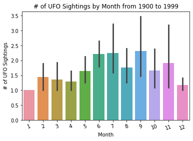
    


```python
sns.barplot(x=cigar_df[(cigar_df['MonthYear'].dt.year >= 1900) & \
                       (cigar_df['MonthYear'].dt.year < 1951)]['MonthYear'].dt.year, \
            y="Location.City",data=cigar_df[(cigar_df['MonthYear'].dt.year >= 1900) & \
                                            (cigar_df['MonthYear'].dt.year < 1951)])

plt.xlabel('Date')
plt.xticks(rotation='vertical')
plt.ylabel('# of UFO Sightings')
plt.title('# of UFO Sightings by Year from 1900 to 1950')
plt.show()
```


    
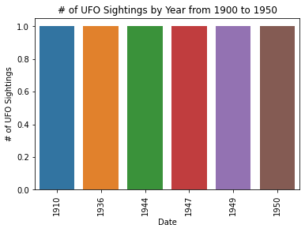
    


```python
sns.barplot(x=cigar_df[(cigar_df['MonthYear'].dt.year >= 1951) & \
                       (cigar_df['MonthYear'].dt.year < 2000)]['MonthYear'].dt.year, \
            y="Location.City",data=cigar_df[(cigar_df['MonthYear'].dt.year >= 1951) & \
                                            (cigar_df['MonthYear'].dt.year < 2000)])

plt.xlabel('Date')
plt.xticks(rotation='vertical')
plt.ylabel('# of UFO Sightings')
plt.title('# of UFO Sightings by Year from 1951 to 1999')
plt.show()
```


    
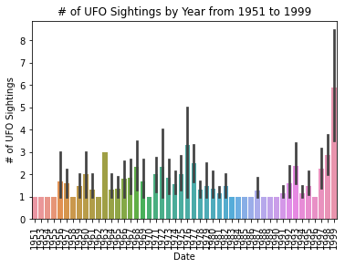
    


```python
sns.barplot(x=cigar_df[(cigar_df['MonthYear'].dt.year >= 2000) & \
                       (cigar_df['MonthYear'].dt.year < 2015)]['MonthYear'].dt.year, \
            y="Location.City",data=cigar_df[(cigar_df['MonthYear'].dt.year >= 2000) & \
                                            (cigar_df['MonthYear'].dt.year < 2015)])

plt.xlabel('Date')
plt.xticks(rotation='vertical')
plt.ylabel('# of UFO Sightings')
plt.title('# of UFO Sightings by Year from 2000 to 2014')
plt.show()
```


    
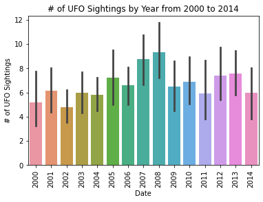
    


#### Unknown UFO Sightings


```python
sns.barplot(x=unknown_df['MonthYear'].dt.month, y="Location.City",data=unknown_df[(unknown_df['MonthYear'].dt.year >= 1900) & (unknown_df['MonthYear'].dt.year < 2000)])
plt.xticks(rotation=20)
plt.xlabel('Month')
plt.ylabel('# of UFO Sightings')
plt.title('# of UFO Sightings by Month from 1900 to 1999')
plt.show()
```


    
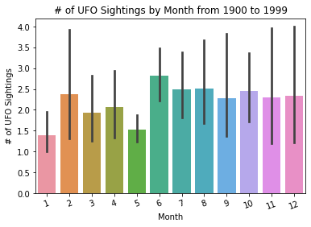
    


```python
sns.barplot(x=unknown_df[(unknown_df['MonthYear'].dt.year >= 1900) & \
                       (unknown_df['MonthYear'].dt.year < 1951)]['MonthYear'].dt.year, \
            y="Location.City",data=unknown_df[(unknown_df['MonthYear'].dt.year >= 1900) & \
                                            (unknown_df['MonthYear'].dt.year < 1951)])

plt.xlabel('Date')
plt.xticks(rotation='vertical')
plt.ylabel('# of UFO Sightings')
plt.title('# of UFO Sightings by Year from 1900 to 1950')
plt.show()
```


    
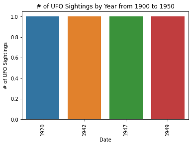
    


```python
sns.barplot(x=unknown_df[(unknown_df['MonthYear'].dt.year >= 1951) & \
                       (unknown_df['MonthYear'].dt.year < 2000)]['MonthYear'].dt.year, \
            y="Location.City",data=unknown_df[(unknown_df['MonthYear'].dt.year >= 1951) & \
                                            (unknown_df['MonthYear'].dt.year < 2000)])

plt.xlabel('Date')
plt.xticks(rotation='vertical')
plt.ylabel('# of UFO Sightings')
plt.title('# of UFO Sightings by Year from 1951 to 1999')
plt.show()
```


    
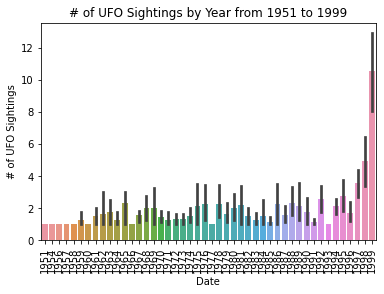
    


#### Disk UFO Sightings


```python
sns.barplot(x=disk_df['MonthYear'].dt.month, y="Location.City",data=disk_df[(disk_df['MonthYear'].dt.year >= 1900) & (disk_df['MonthYear'].dt.year < 2000)])
plt.xticks(rotation=20)
plt.xlabel('Month')
plt.ylabel('# of UFO Sightings')
plt.title('# of UFO Sightings by Month from 1900 to 1999')
plt.show()
```


    
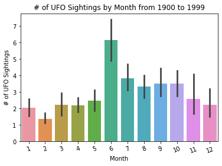
    


```python
sns.barplot(x=disk_df[(disk_df['MonthYear'].dt.year >= 1900) & \
                       (disk_df['MonthYear'].dt.year < 1951)]['MonthYear'].dt.year, \
            y="Location.City",data=disk_df[(disk_df['MonthYear'].dt.year >= 1900) & \
                                            (disk_df['MonthYear'].dt.year < 1951)])

plt.xlabel('Date')
plt.xticks(rotation='vertical')
plt.ylabel('# of UFO Sightings')
plt.title('# of UFO Sightings by Year from 1900 to 1950')
plt.show()
```


    
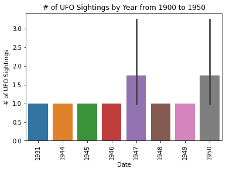
    


```python
sns.barplot(x=disk_df[(disk_df['MonthYear'].dt.year >= 2000) & \
                       (disk_df['MonthYear'].dt.year < 2015)]['MonthYear'].dt.year, \
            y="Location.City",data=disk_df[(disk_df['MonthYear'].dt.year >= 2000) & \
                                            (disk_df['MonthYear'].dt.year < 2015)])

plt.xlabel('Date')
plt.xticks(rotation='vertical')
plt.ylabel('# of UFO Sightings')
plt.title('# of UFO Sightings by Year from 2000 to 2014')
plt.show()
```


    
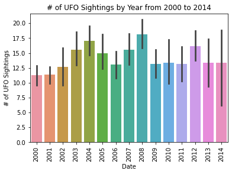
    


### Exploratory Question: Do most sightings occur in the daytime or nighttime?

We defined sunrise as 07:00, and sunset as 19:00.  Daytime is from 07:00-18:59, nighttime is 19:00-06:59. \
The hours and minutes in the original dataframe are represented in military time.


```python
df["Time"] = df['Dates.Sighted.Year'].astype(str) + "-"+ df['Dates.Sighted.Month'].astype(str) + "-" + df['Date.Sighted.Day'].astype(str) + " " + df["Dates.Sighted.Hour"].astype(str) + ":" + df["Dates.Sighted.Minute"].astype(str)
df["Time"] = pd.to_datetime(df["Time"]).dt.time
daytime = df[(df["Dates.Sighted.Hour"] >= 7) & (df["Dates.Sighted.Hour"] < 19)]
```


```python
nighttime = df[(df["Dates.Sighted.Hour"] < 7) | (df["Dates.Sighted.Hour"] >= 19)]
```


```python
numSightingsByHr = df.groupby(df["Dates.Sighted.Hour"]).count()
```


```python
sns.barplot(x=numSightingsByHr.index, y=numSightingsByHr["Time"], data=numSightingsByHr)
plt.xlabel('Hour of Day')
plt.xticks(rotation='vertical')
plt.ylabel('# of UFO Sightings')
plt.title('# of UFO Sightings by Hour of Day')
plt.show()
```


    
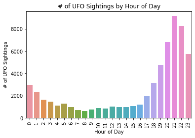
    


From this bar graph, it seems like there are more sightings at nighttime, specifically between the hours of 7pm to 11pm.

## Hypothesis Test: Mann Whitney U
Our null hypothesis is that there is no significant difference in the number of UFO sightings during the daytime and nighttime hours. Our alternative hypothesis is that there is a significant difference in the number of UFO sightings during the daytime and nighttime hours.  
H₀: μₛ=μₐ  
Hₐ: μₛ≠μₐ

We conducted the hypothesis test using a 0.05 significance level. α=0.05

Source: https://towardsdatascience.com/hypothesis-testing-with-python-step-by-step-hands-on-tutorial-with-practical-examples-e805975ea96e

We decided to use a Mann Whitney U Test because it is a non-parametric test that doesn't assume that the data has a specific distribution type like being normally distributed. Moreover, our data is unpaired, meaning that our data does not survey the witnesses at 2 different points in time.


```python
day_count = daytime.groupby('Dates.Sighted.Hour').count()
night_count = nighttime.groupby('Dates.Sighted.Hour').count()
```


```python
day_count
```


<div>
<style scoped>
    .dataframe tbody tr th:only-of-type {
        vertical-align: middle;
    }

    .dataframe tbody tr th {
        vertical-align: top;
    }

    .dataframe thead th {
        text-align: right;
    }
</style>
<table border="1" class="dataframe">
  <thead>
    <tr style="text-align: right;">
      <th></th>
      <th>Location.City</th>
      <th>Location.State</th>
      <th>Location.Country</th>
      <th>Data.Shape</th>
      <th>Data.Encounter duration</th>
      <th>Data.Description excerpt</th>
      <th>Location.Coordinates.Latitude</th>
      <th>Location.Coordinates.Longitude</th>
      <th>Dates.Sighted.Year</th>
      <th>Dates.Sighted.Month</th>
      <th>Date.Sighted.Day</th>
      <th>Dates.Sighted.Minute</th>
      <th>Dates.Documented.Year</th>
      <th>Dates.Documented.Month</th>
      <th>Dates.Documented.Day</th>
      <th>Date</th>
      <th>MonthYear</th>
      <th>Time</th>
    </tr>
    <tr>
      <th>Dates.Sighted.Hour</th>
      <th></th>
      <th></th>
      <th></th>
      <th></th>
      <th></th>
      <th></th>
      <th></th>
      <th></th>
      <th></th>
      <th></th>
      <th></th>
      <th></th>
      <th></th>
      <th></th>
      <th></th>
      <th></th>
      <th></th>
      <th></th>
    </tr>
  </thead>
  <tbody>
    <tr>
      <th>7</th>
      <td>690</td>
      <td>690</td>
      <td>690</td>
      <td>690</td>
      <td>690</td>
      <td>690</td>
      <td>690</td>
      <td>690</td>
      <td>690</td>
      <td>690</td>
      <td>690</td>
      <td>690</td>
      <td>690</td>
      <td>690</td>
      <td>690</td>
      <td>690</td>
      <td>690</td>
      <td>690</td>
    </tr>
    <tr>
      <th>8</th>
      <td>617</td>
      <td>617</td>
      <td>617</td>
      <td>617</td>
      <td>617</td>
      <td>617</td>
      <td>617</td>
      <td>617</td>
      <td>617</td>
      <td>617</td>
      <td>617</td>
      <td>617</td>
      <td>617</td>
      <td>617</td>
      <td>617</td>
      <td>617</td>
      <td>617</td>
      <td>617</td>
    </tr>
    <tr>
      <th>9</th>
      <td>766</td>
      <td>766</td>
      <td>766</td>
      <td>766</td>
      <td>766</td>
      <td>766</td>
      <td>766</td>
      <td>766</td>
      <td>766</td>
      <td>766</td>
      <td>766</td>
      <td>766</td>
      <td>766</td>
      <td>766</td>
      <td>766</td>
      <td>766</td>
      <td>766</td>
      <td>766</td>
    </tr>
    <tr>
      <th>10</th>
      <td>902</td>
      <td>902</td>
      <td>902</td>
      <td>902</td>
      <td>902</td>
      <td>902</td>
      <td>902</td>
      <td>902</td>
      <td>902</td>
      <td>902</td>
      <td>902</td>
      <td>902</td>
      <td>902</td>
      <td>902</td>
      <td>902</td>
      <td>902</td>
      <td>902</td>
      <td>902</td>
    </tr>
    <tr>
      <th>11</th>
      <td>850</td>
      <td>850</td>
      <td>850</td>
      <td>850</td>
      <td>850</td>
      <td>850</td>
      <td>850</td>
      <td>850</td>
      <td>850</td>
      <td>850</td>
      <td>850</td>
      <td>850</td>
      <td>850</td>
      <td>850</td>
      <td>850</td>
      <td>850</td>
      <td>850</td>
      <td>850</td>
    </tr>
    <tr>
      <th>12</th>
      <td>1016</td>
      <td>1016</td>
      <td>1016</td>
      <td>1016</td>
      <td>1016</td>
      <td>1016</td>
      <td>1016</td>
      <td>1016</td>
      <td>1016</td>
      <td>1016</td>
      <td>1016</td>
      <td>1016</td>
      <td>1016</td>
      <td>1016</td>
      <td>1016</td>
      <td>1016</td>
      <td>1016</td>
      <td>1016</td>
    </tr>
    <tr>
      <th>13</th>
      <td>962</td>
      <td>962</td>
      <td>962</td>
      <td>962</td>
      <td>962</td>
      <td>962</td>
      <td>962</td>
      <td>962</td>
      <td>962</td>
      <td>962</td>
      <td>962</td>
      <td>962</td>
      <td>962</td>
      <td>962</td>
      <td>962</td>
      <td>962</td>
      <td>962</td>
      <td>962</td>
    </tr>
    <tr>
      <th>14</th>
      <td>956</td>
      <td>956</td>
      <td>956</td>
      <td>956</td>
      <td>956</td>
      <td>956</td>
      <td>956</td>
      <td>956</td>
      <td>956</td>
      <td>956</td>
      <td>956</td>
      <td>956</td>
      <td>956</td>
      <td>956</td>
      <td>956</td>
      <td>956</td>
      <td>956</td>
      <td>956</td>
    </tr>
    <tr>
      <th>15</th>
      <td>1063</td>
      <td>1063</td>
      <td>1063</td>
      <td>1063</td>
      <td>1063</td>
      <td>1063</td>
      <td>1063</td>
      <td>1063</td>
      <td>1063</td>
      <td>1063</td>
      <td>1063</td>
      <td>1063</td>
      <td>1063</td>
      <td>1063</td>
      <td>1063</td>
      <td>1063</td>
      <td>1063</td>
      <td>1063</td>
    </tr>
    <tr>
      <th>16</th>
      <td>1208</td>
      <td>1208</td>
      <td>1208</td>
      <td>1208</td>
      <td>1208</td>
      <td>1208</td>
      <td>1208</td>
      <td>1208</td>
      <td>1208</td>
      <td>1208</td>
      <td>1208</td>
      <td>1208</td>
      <td>1208</td>
      <td>1208</td>
      <td>1208</td>
      <td>1208</td>
      <td>1208</td>
      <td>1208</td>
    </tr>
    <tr>
      <th>17</th>
      <td>1988</td>
      <td>1988</td>
      <td>1988</td>
      <td>1988</td>
      <td>1988</td>
      <td>1988</td>
      <td>1988</td>
      <td>1988</td>
      <td>1988</td>
      <td>1988</td>
      <td>1988</td>
      <td>1988</td>
      <td>1988</td>
      <td>1988</td>
      <td>1988</td>
      <td>1988</td>
      <td>1988</td>
      <td>1988</td>
    </tr>
    <tr>
      <th>18</th>
      <td>3123</td>
      <td>3123</td>
      <td>3123</td>
      <td>3123</td>
      <td>3123</td>
      <td>3123</td>
      <td>3123</td>
      <td>3123</td>
      <td>3123</td>
      <td>3123</td>
      <td>3123</td>
      <td>3123</td>
      <td>3123</td>
      <td>3123</td>
      <td>3123</td>
      <td>3123</td>
      <td>3123</td>
      <td>3123</td>
    </tr>
  </tbody>
</table>
</div>


## Testing Assumptions: Data is normally distributed


```python
x = df.groupby('Dates.Sighted.Hour').count()
```


```python
def is_normal(data):
    ttest, p_val=stats.shapiro(data)
    print('p-val:', p_val)
    if p_val <0.05:
        print("Data is not normally distributed")
    else:
        print("Data is normally distributed")

print('Day Data:')
is_normal(day_count['Location.City'])
```

    Day Data:
    p-val: 0.0007532542804256082
    Data is not normally distributed


We checked for normality by using the Shapiro–Wilk test and noticed that our data was not normally distributed, thus we could not satisfy the assumption that our data was normally distributed for an independent t-test. So, we decided to use Mann Whitney U.


```python
ttest,pval = stats.mannwhitneyu(day_count['Location.City'], night_count['Location.City'], alternative="two-sided")

print("p-value:",  pval)
if pval <0.05:
    print("Reject null hypothesis")
else:
    print("Fail to reject null hypothesis")
```

    p-value: 0.0020095048556600134
    Reject null hypothesis


Since our p-value is less than 0.05, we can reject our null hypothesis. Thus we observed that there is a significant difference between the number of UFO sightings during the daytime and nighttime.

### Predicting number of UFO sightings given a latitude and longitude


```python
# X = df[["Location.Coordinates.Latitude", "Location.Coordinates.Longitude"]]
# y = 
count_sightings = df.groupby(["Location.Coordinates.Latitude ", "Location.Coordinates.Longitude "]).count()
count_sightings.head()
```


<div>
<style scoped>
    .dataframe tbody tr th:only-of-type {
        vertical-align: middle;
    }

    .dataframe tbody tr th {
        vertical-align: top;
    }

    .dataframe thead th {
        text-align: right;
    }
</style>
<table border="1" class="dataframe">
  <thead>
    <tr style="text-align: right;">
      <th></th>
      <th></th>
      <th>Location.City</th>
      <th>Location.State</th>
      <th>Location.Country</th>
      <th>Data.Shape</th>
      <th>Data.Encounter duration</th>
      <th>Data.Description excerpt</th>
      <th>Dates.Sighted.Year</th>
      <th>Dates.Sighted.Month</th>
      <th>Date.Sighted.Day</th>
      <th>Dates.Sighted.Hour</th>
      <th>Dates.Sighted.Minute</th>
      <th>Dates.Documented.Year</th>
      <th>Dates.Documented.Month</th>
      <th>Dates.Documented.Day</th>
      <th>Date</th>
      <th>MonthYear</th>
      <th>Time</th>
    </tr>
    <tr>
      <th>Location.Coordinates.Latitude</th>
      <th>Location.Coordinates.Longitude</th>
      <th></th>
      <th></th>
      <th></th>
      <th></th>
      <th></th>
      <th></th>
      <th></th>
      <th></th>
      <th></th>
      <th></th>
      <th></th>
      <th></th>
      <th></th>
      <th></th>
      <th></th>
      <th></th>
      <th></th>
    </tr>
  </thead>
  <tbody>
    <tr>
      <th>19.426944</th>
      <th>-155.913056</th>
      <td>2</td>
      <td>2</td>
      <td>2</td>
      <td>2</td>
      <td>2</td>
      <td>2</td>
      <td>2</td>
      <td>2</td>
      <td>2</td>
      <td>2</td>
      <td>2</td>
      <td>2</td>
      <td>2</td>
      <td>2</td>
      <td>2</td>
      <td>2</td>
      <td>2</td>
    </tr>
    <tr>
      <th>19.430833</th>
      <th>-155.237778</th>
      <td>1</td>
      <td>1</td>
      <td>1</td>
      <td>1</td>
      <td>1</td>
      <td>1</td>
      <td>1</td>
      <td>1</td>
      <td>1</td>
      <td>1</td>
      <td>1</td>
      <td>1</td>
      <td>1</td>
      <td>1</td>
      <td>1</td>
      <td>1</td>
      <td>1</td>
    </tr>
    <tr>
      <th>19.496944</th>
      <th>-155.921667</th>
      <td>2</td>
      <td>2</td>
      <td>2</td>
      <td>2</td>
      <td>2</td>
      <td>2</td>
      <td>2</td>
      <td>2</td>
      <td>2</td>
      <td>2</td>
      <td>2</td>
      <td>2</td>
      <td>2</td>
      <td>2</td>
      <td>2</td>
      <td>2</td>
      <td>2</td>
    </tr>
    <tr>
      <th>19.497500</th>
      <th>-154.950833</th>
      <td>4</td>
      <td>4</td>
      <td>4</td>
      <td>4</td>
      <td>4</td>
      <td>4</td>
      <td>4</td>
      <td>4</td>
      <td>4</td>
      <td>4</td>
      <td>4</td>
      <td>4</td>
      <td>4</td>
      <td>4</td>
      <td>4</td>
      <td>4</td>
      <td>4</td>
    </tr>
    <tr>
      <th>19.506111</th>
      <th>-154.848611</th>
      <td>1</td>
      <td>1</td>
      <td>1</td>
      <td>1</td>
      <td>1</td>
      <td>1</td>
      <td>1</td>
      <td>1</td>
      <td>1</td>
      <td>1</td>
      <td>1</td>
      <td>1</td>
      <td>1</td>
      <td>1</td>
      <td>1</td>
      <td>1</td>
      <td>1</td>
    </tr>
  </tbody>
</table>
</div>


```python
lats = []
longs = []
num_sightings = []
for i in range(len(count_sightings["Location.City"])):
    lats.append(count_sightings.index[i][0])
    longs.append(count_sightings.index[i][1])
    num_sightings.append(count_sightings["Location.City"][count_sightings.index[i]])
coords = pd.DataFrame({"lats": lats, "longs": longs, "num_sightings": num_sightings})
coords
```


<div>
<style scoped>
    .dataframe tbody tr th:only-of-type {
        vertical-align: middle;
    }

    .dataframe tbody tr th {
        vertical-align: top;
    }

    .dataframe thead th {
        text-align: right;
    }
</style>
<table border="1" class="dataframe">
  <thead>
    <tr style="text-align: right;">
      <th></th>
      <th>lats</th>
      <th>longs</th>
      <th>num_sightings</th>
    </tr>
  </thead>
  <tbody>
    <tr>
      <th>0</th>
      <td>19.426944</td>
      <td>-155.913056</td>
      <td>2</td>
    </tr>
    <tr>
      <th>1</th>
      <td>19.430833</td>
      <td>-155.237778</td>
      <td>1</td>
    </tr>
    <tr>
      <th>2</th>
      <td>19.496944</td>
      <td>-155.921667</td>
      <td>2</td>
    </tr>
    <tr>
      <th>3</th>
      <td>19.497500</td>
      <td>-154.950833</td>
      <td>4</td>
    </tr>
    <tr>
      <th>4</th>
      <td>19.506111</td>
      <td>-154.848611</td>
      <td>1</td>
    </tr>
    <tr>
      <th>...</th>
      <td>...</td>
      <td>...</td>
      <td>...</td>
    </tr>
    <tr>
      <th>12527</th>
      <td>65.263611</td>
      <td>-166.360833</td>
      <td>2</td>
    </tr>
    <tr>
      <th>12528</th>
      <td>66.898333</td>
      <td>-162.596667</td>
      <td>1</td>
    </tr>
    <tr>
      <th>12529</th>
      <td>67.013889</td>
      <td>-146.418611</td>
      <td>1</td>
    </tr>
    <tr>
      <th>12530</th>
      <td>70.131944</td>
      <td>-143.623889</td>
      <td>1</td>
    </tr>
    <tr>
      <th>12531</th>
      <td>70.636944</td>
      <td>-160.038333</td>
      <td>1</td>
    </tr>
  </tbody>
</table>
<p>12532 rows × 3 columns</p>
</div>


### Fitting a Linear Regression Model


```python
X = coords[["lats", "longs"]]
y = coords["num_sightings"]
X = sm.add_constant(X)

model = sm.OLS(y, X).fit()
model.summary()
```


<table class="simpletable">
<caption>OLS Regression Results</caption>
<tr>
  <th>Dep. Variable:</th>      <td>num_sightings</td>  <th>  R-squared:         </th> <td>   0.013</td> 
</tr>
<tr>
  <th>Model:</th>                   <td>OLS</td>       <th>  Adj. R-squared:    </th> <td>   0.013</td> 
</tr>
<tr>
  <th>Method:</th>             <td>Least Squares</td>  <th>  F-statistic:       </th> <td>   85.32</td> 
</tr>
<tr>
  <th>Date:</th>             <td>Fri, 12 May 2023</td> <th>  Prob (F-statistic):</th> <td>1.58e-37</td> 
</tr>
<tr>
  <th>Time:</th>                 <td>14:17:42</td>     <th>  Log-Likelihood:    </th> <td> -50775.</td> 
</tr>
<tr>
  <th>No. Observations:</th>      <td> 12532</td>      <th>  AIC:               </th> <td>1.016e+05</td>
</tr>
<tr>
  <th>Df Residuals:</th>          <td> 12529</td>      <th>  BIC:               </th> <td>1.016e+05</td>
</tr>
<tr>
  <th>Df Model:</th>              <td>     2</td>      <th>                     </th>     <td> </td>    
</tr>
<tr>
  <th>Covariance Type:</th>      <td>nonrobust</td>    <th>                     </th>     <td> </td>    
</tr>
</table>
<table class="simpletable">
<tr>
    <td></td>       <th>coef</th>     <th>std err</th>      <th>t</th>      <th>P>|t|</th>  <th>[0.025</th>    <th>0.975]</th>  
</tr>
<tr>
  <th>const</th> <td>    1.3355</td> <td>    1.206</td> <td>    1.107</td> <td> 0.268</td> <td>   -1.028</td> <td>    3.699</td>
</tr>
<tr>
  <th>lats</th>  <td>   -0.1239</td> <td>    0.025</td> <td>   -5.042</td> <td> 0.000</td> <td>   -0.172</td> <td>   -0.076</td>
</tr>
<tr>
  <th>longs</th> <td>   -0.0920</td> <td>    0.008</td> <td>  -11.924</td> <td> 0.000</td> <td>   -0.107</td> <td>   -0.077</td>
</tr>
</table>
<table class="simpletable">
<tr>
  <th>Omnibus:</th>       <td>24075.524</td> <th>  Durbin-Watson:     </th>   <td>   1.974</td>  
</tr>
<tr>
  <th>Prob(Omnibus):</th>  <td> 0.000</td>   <th>  Jarque-Bera (JB):  </th> <td>60198647.441</td>
</tr>
<tr>
  <th>Skew:</th>           <td>14.961</td>   <th>  Prob(JB):          </th>   <td>    0.00</td>  
</tr>
<tr>
  <th>Kurtosis:</th>       <td>341.217</td>  <th>  Cond. No.          </th>   <td>    968.</td>  
</tr>
</table><br/><br/>Notes:<br/>[1] Standard Errors assume that the covariance matrix of the errors is correctly specified.


### Checking Assumptions

Goal: check that the residuals are independent normal random variables with mean 0 and constant variance
Method 1: Plot residuals vs. covariate \
Conclusion: For both latitude and longitude as separate predictors, mean is 0 and variance is around 1, but this is not very accurate, especially in terms of variance in longitude.

```python
x = coords["lats"]
y = coords["num_sightings"]
model_lats = sm.OLS(y, sm.add_constant(x)).fit()
# plt.plot(x , model.resid, '.' , markersize =0.5)
sns.regplot(x, abs(model_lats.resid), lowess=True, \
line_kws = {'color': 'black'}, \
scatter_kws = {'s' : 0.5})
```

    C:\ProgramData\Anaconda3\lib\site-packages\seaborn\_decorators.py:36: FutureWarning: Pass the following variables as keyword args: x, y. From version 0.12, the only valid positional argument will be `data`, and passing other arguments without an explicit keyword will result in an error or misinterpretation.
      warnings.warn(


    <AxesSubplot:xlabel='lats'>


    
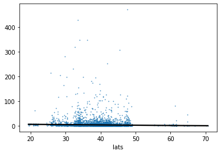
    


```python
x = coords["longs"]
y = coords["num_sightings"]
model_longs = sm.OLS(y, sm.add_constant(x)).fit()
# plt.plot(x , model.resid, '.' , markersize =0.5)
sns.regplot(x, abs(model_longs.resid), lowess=True, \
line_kws = {'color': 'black'}, \
scatter_kws = {'s' : 0.5})
```

    C:\ProgramData\Anaconda3\lib\site-packages\seaborn\_decorators.py:36: FutureWarning: Pass the following variables as keyword args: x, y. From version 0.12, the only valid positional argument will be `data`, and passing other arguments without an explicit keyword will result in an error or misinterpretation.
      warnings.warn(


    <AxesSubplot:xlabel='longs'>


    
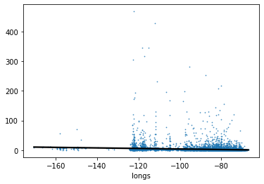
    


Method 2: Autocorrelation Plot \
Conclusion: Errors are independent


```python
import statsmodels.graphics.tsaplots as tsa
resid = model.resid
tsa.plot_acf(resid)
plt.xlabel('Lag')
plt.ylabel('Autocorrelation')
plt.title('Residuals')
plt.show()
```


    
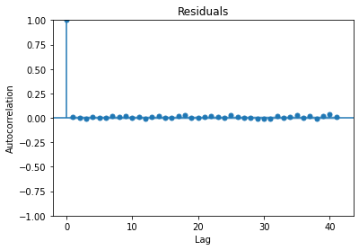
    


Method 3: QQ Plot \
Conclusion: Errors are not normal


```python
plt.hist(model.resid)
sm.qqplot(model.resid , line='r')
plt.show()
```


    
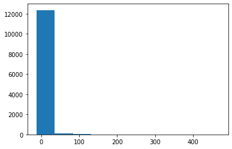
    


    
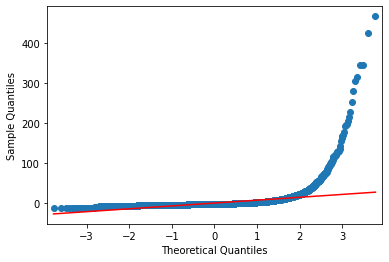
    


Since the errors are not normal, we transform of the outcome y to make it normal. \
Sources:
- https://thomaselove.github.io/2018-431-book/using-transformations-to-normalize-distributions.html
- https://www.baeldung.com/cs/normalization-vs-standardization
- https://online.stat.psu.edu/stat501/book/export/html/956
- https://data.library.virginia.edu/interpreting-log-transformations-in-a-linear-model/


```python
X = coords[["lats", "longs"]]
y = np.log(coords["num_sightings"])
X = sm.add_constant(X)

model_2 = sm.GLM(y, X).fit()
model_2.summary()
```


<table class="simpletable">
<caption>Generalized Linear Model Regression Results</caption>
<tr>
  <th>Dep. Variable:</th>     <td>num_sightings</td>  <th>  No. Observations:  </th>  <td> 12532</td> 
</tr>
<tr>
  <th>Model:</th>                  <td>GLM</td>       <th>  Df Residuals:      </th>  <td> 12529</td> 
</tr>
<tr>
  <th>Model Family:</th>        <td>Gaussian</td>     <th>  Df Model:          </th>  <td>     2</td> 
</tr>
<tr>
  <th>Link Function:</th>       <td>identity</td>     <th>  Scale:             </th> <td> 0.95372</td>
</tr>
<tr>
  <th>Method:</th>                <td>IRLS</td>       <th>  Log-Likelihood:    </th> <td> -17484.</td>
</tr>
<tr>
  <th>Date:</th>            <td>Fri, 12 May 2023</td> <th>  Deviance:          </th> <td>  11949.</td>
</tr>
<tr>
  <th>Time:</th>                <td>20:53:08</td>     <th>  Pearson chi2:      </th> <td>1.19e+04</td>
</tr>
<tr>
  <th>No. Iterations:</th>          <td>3</td>        <th>  Pseudo R-squ. (CS):</th>  <td>0.01643</td>
</tr>
<tr>
  <th>Covariance Type:</th>     <td>nonrobust</td>    <th>                     </th>     <td> </td>   
</tr>
</table>
<table class="simpletable">
<tr>
    <td></td>       <th>coef</th>     <th>std err</th>      <th>z</th>      <th>P>|z|</th>  <th>[0.025</th>    <th>0.975]</th>  
</tr>
<tr>
  <th>const</th> <td>    0.6592</td> <td>    0.085</td> <td>    7.787</td> <td> 0.000</td> <td>    0.493</td> <td>    0.825</td>
</tr>
<tr>
  <th>lats</th>  <td>   -0.0113</td> <td>    0.002</td> <td>   -6.547</td> <td> 0.000</td> <td>   -0.015</td> <td>   -0.008</td>
</tr>
<tr>
  <th>longs</th> <td>   -0.0069</td> <td>    0.001</td> <td>  -12.673</td> <td> 0.000</td> <td>   -0.008</td> <td>   -0.006</td>
</tr>
</table>


```python
resid = model_2.resid_response
tsa.plot_acf(resid)
plt.xlabel('Lag')
plt.ylabel('Autocorrelation')
plt.title('Residuals')
plt.show()
```


    
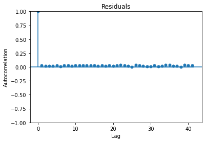
    


```python
plt.hist(model_2.resid_response)
sm.qqplot(model_2.resid_response , line='r')
plt.show()
```


    
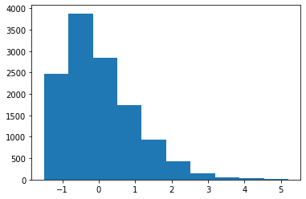
    


    
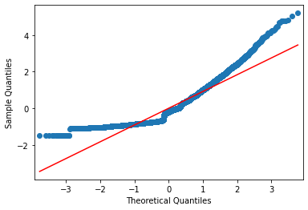
    


After trying many different transformations, we failed to make the errors totally normal.  Although this doesn't really eliminate the fact that the errors are not normal, using a generalized linear model and doing a log-transformation of the Y values (as per lecture 15, slide 57) lessened the skew a little more.  Therefore, we continue on and analyze the linear regression as is, knowing that the caveat of this is that the distribution of errors is not normal, thus violating an assumption of linear regression analysis.

Based on the model summary of the log-transformed model, the constant is 0.6592, which means at latitude 0 and longitude 0, you would expect to see 0.65 UFOs in approximately a century's worth of time.  For every 1 degree increase in latitude, we expect to see e^-0.0113 = 0.989 more UFOs.  For every 1 degree increase in longitude, we expect to see e^-0.0069 = 0.99 more UFOs.

Overall, latitude and longitude alone don't have that much of an effect on how many UFO sightings there will be, given a R^2 value of 0.01643.  This shows that latitude and longitude affect around 1% of the variability in UFO sightings.


```python
from sklearn.cluster import KMeans
from sklearn.preprocessing import LabelEncoder


# Load the data from the CSV file
data = pd.read_csv('ufo_sightings.csv')

# Convert the shape variable to numeric values using label encoding
encoder = LabelEncoder()
data['shape_encoded'] = encoder.fit_transform(data['Data.Shape'])

# Select the variables to be used for clustering
X = data[['Location.Coordinates.Latitude ', 'Location.Coordinates.Longitude ', 'shape_encoded']].values

# Choose the number of clusters
k = 5

# Initialize the k-means algorithm with the chosen number of clusters
kmeans = KMeans(n_clusters=k)

# Fit the data to the k-means algorithm
kmeans.fit(X)

# Get the cluster labels for each data point
labels = kmeans.labels_
plt.figure(figsize=(12, 8))


# Plot the clusters on a scatter plot
plt.scatter(X[:, 1], X[:, 0], c=labels, cmap='rainbow')
plt.title('UFO Sightings Clustering')
plt.xlabel('Longitude')
plt.ylabel('Latitude')
plt.legend(labels)
plt.show()
```


    
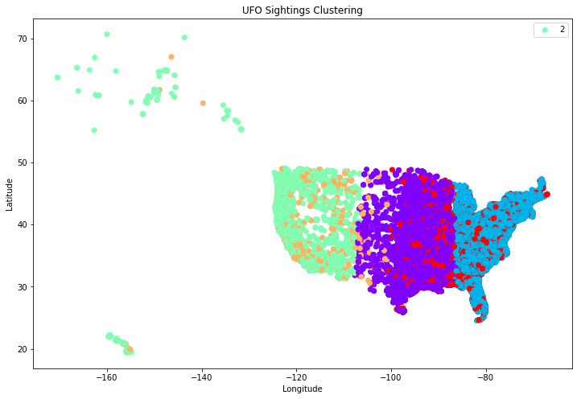
    


This shows three main clusters based on the location of the sighting and the shape recorded. 

To focus in on mainland US, the data from Alaska and Hawaii are excluded. 


```python
data = data[(data["Location.State"]!= "AK") & (data["Location.State"]!= "HI")]
```


```python

# Convert the shape variable to numeric values using label encoding
encoder = LabelEncoder()
data['shape_encoded'] = encoder.fit_transform(data['Data.Shape'])

# Select the variables to be used for clustering
X = data[['Location.Coordinates.Latitude ', 'Location.Coordinates.Longitude ', 'shape_encoded']].values

# Choose the number of clusters
k = 5

# Initialize the k-means algorithm with the chosen number of clusters
kmeans = KMeans(n_clusters=k)

# Fit the data to the k-means algorithm
kmeans.fit(X)

# Get the cluster labels for each data point
labels = kmeans.labels_
plt.figure(figsize=(12, 8))


# Plot the clusters on a scatter plot
plt.scatter(X[:, 1], X[:, 0], c=labels, cmap='rainbow')
plt.title('UFO Sightings Clustering')
plt.xlabel('Longitude')
plt.ylabel('Latitude')
plt.legend(labels)
plt.show()
```


    
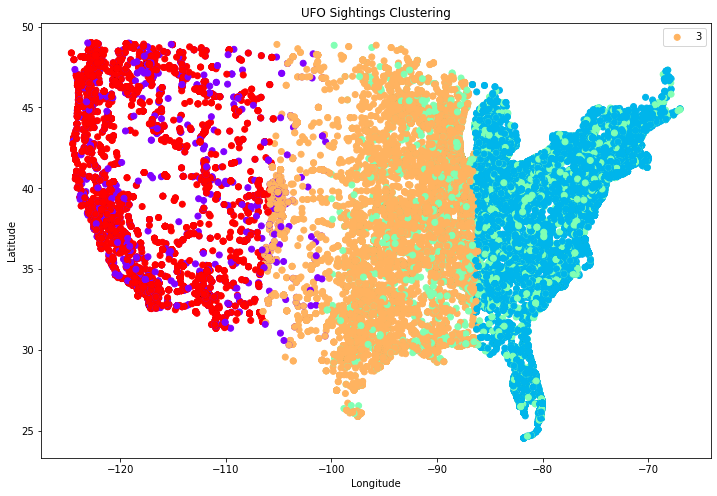
    


This more clearly shows the three main clusters found on the mainland. They are divided into three regions representing the eastern, central, and western parts of the continental US.


```python

# Select the variable to be used for clustering (shape)
X = data['shape_encoded'].values.reshape(-1, 1)

# Choose the number of clusters
k = 5

# Initialize the k-means algorithm with the chosen number of clusters
kmeans = KMeans(n_clusters=k)

# Fit the data to the k-means algorithm
kmeans.fit(X)

# Get the cluster labels for each data point
labels = kmeans.labels_
plt.figure(figsize=(12, 8))
# Plot the clusters on a scatter plot
plt.scatter(data['Location.Coordinates.Longitude '], data['Location.Coordinates.Latitude '], c=labels, cmap='rainbow')
plt.title('UFO Sightings Clustering (Shape)')
plt.xlabel('Longitude')
plt.ylabel('Latitude')
plt.show()

```


    
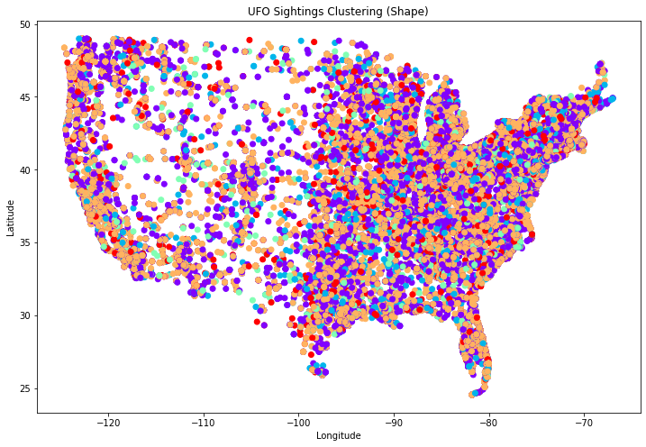
    


However, the clustering just based on the shape of UFO sightings does not show significant clusters in the graph, it may indicate that there is no clear or distinct pattern in the shape of the UFOs reported in the dataset. Some possible explanations of this may be due to reporting bias. In other words, the lack of clear clusters could be influenced by reporting bias, where people may have different interpretations or descriptions of UFO shapes, leading to a diverse range of reported shapes without distinct groupings. The influence of other factors may have also led to this conclusion. UFO sightings may be influenced by various factors other than shape, such as location, time of day, or witness perception. If these factors have a stronger influence on the clustering, it may overshadow the patterns related to the shape of the UFOs.
